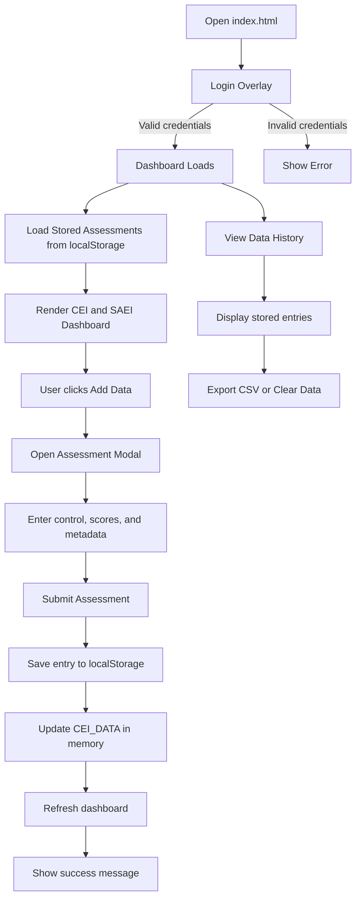
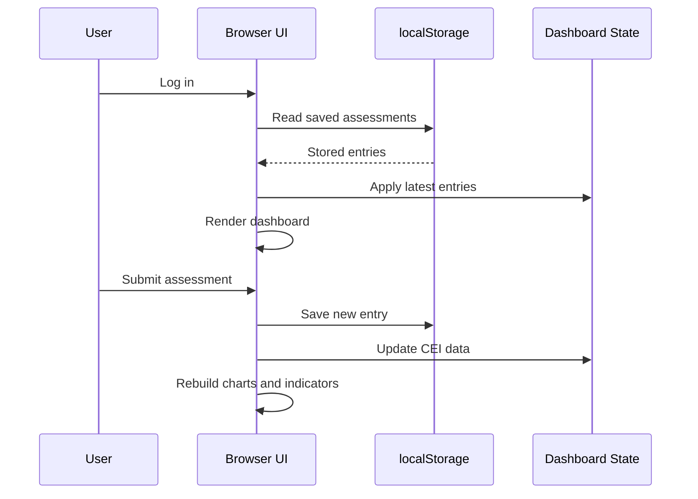

# Control 360 Process Flow

## Purpose

## High-Level Flow

## Detailed Process

### 1. Application Start
- The user opens [index.html](index.html).
- The login overlay blocks access to the dashboard until authentication succeeds.
- The app uses a demo login: `admin / Botswana1`.

### 2. Authentication
- The user enters a username and password.
- If the credentials match, the login overlay is hidden.
- If the credentials are invalid, the app shows an error and keeps the user on the login screen.

### 3. Initial Dashboard Load
- Once logged in, the dashboard is displayed.
- The app reads saved assessment entries from `localStorage` using the key `control360_cei_data`.
- For each control, the most recent saved entry is applied to the in-memory CEI data.
- The CEI and SAEI sections are then rendered with the latest values.

### 4. Add Data Workflow
- The user clicks **Add Data**.
- The assessment modal opens.
- The modal defaults the assessment date to today.
- The user selects a control and enters the four component scores:
  - Implementation
  - Verification
  - Compliance
  - Outcome
- The user can also enter:
  - Assessor name
  - Department or area
  - Risk level
  - Verification method
  - Findings count
  - Notes

### 5. Real-Time Score Preview
- As the user types the component scores, the modal updates the total score preview.
- The total is color coded by range:
  - 90 to 100: green
  - 80 to 89: blue
  - 70 to 79: amber
  - Below 70: red

### 6. Submission and Persistence
- When the user submits the form, the app calculates the total score.
- A new assessment object is created with all entered fields plus timestamps.
- The entry is appended to `localStorage`.
- To keep browser storage bounded, only the most recent 100 entries are retained.

### 7. Dashboard Refresh
- After saving, the app updates the in-memory CEI dataset for the selected control.
- The dashboard is rebuilt so the CEI table, SAEI summary, charts, rings, and status indicators reflect the new data.
- The user sees a success alert and the modal closes.

### 8. View History Workflow
- The user can open the Data History modal at any time.
- The app loads all stored entries from `localStorage`.
- Entries are shown most recent first.
- The table displays assessment date, control, assessor, department, scores, total, risk level, and related metadata.

### 9. Export and Cleanup
- The user can export all stored entries to CSV for reporting or offline analysis.
- The user can clear all stored data with confirmation.
- Clearing data removes the saved localStorage entry and reloads the page back to default values.

## Data Flow Summary

## Key Outputs
- Login validation feedback
- Updated CEI scores for the selected control
- Recalculated SAEI summary
- History table with stored assessment records
- CSV export for reporting

## Architecture Considerations
- This process flow reflects the current browser-based implementation, but the architecture may change once the actual data set is reviewed.
- We have not yet seen the real operational data, so the storage, reporting, and dashboard logic may need to be adjusted.
- Power BI is also a known option and could become a secondary reporting or visualization layer if it fits the final data and governance requirements better.

## Notes  
- This is a browser-only demo and does not use a backend API.
- Data is persistent only within the current browser and device.
- Clearing browser storage removes all saved assessments.
